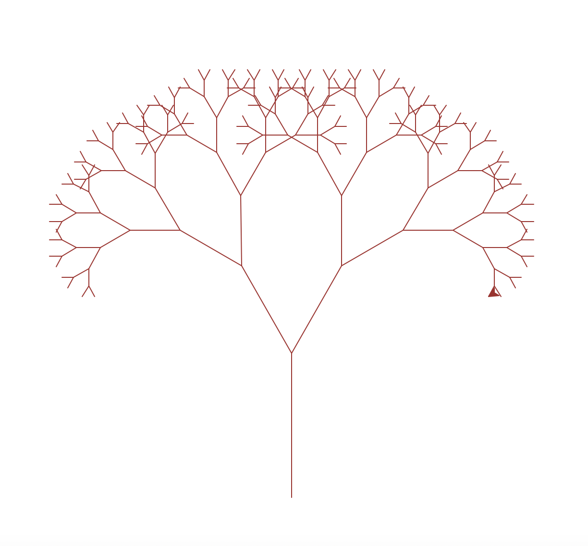
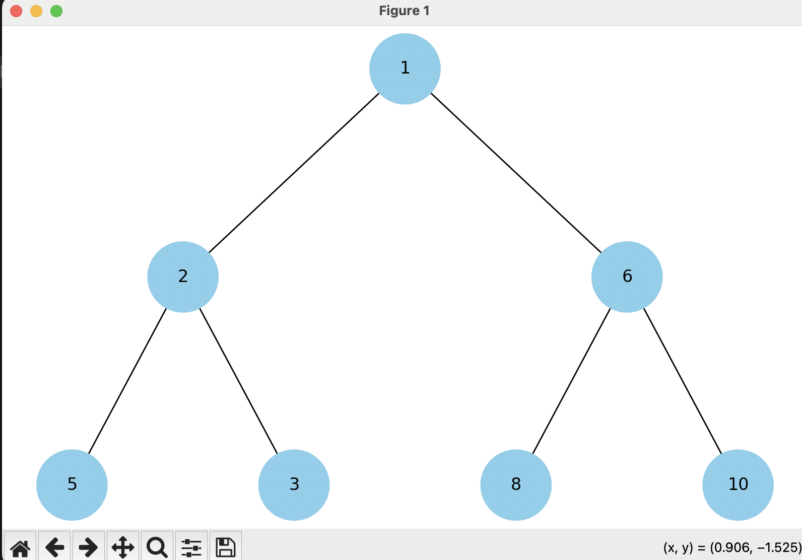

# goit-algo-fp

## Завдання 1. Структури даних. Сортування. Робота з однозв'язним списком

Для реалізації однозв'язного списку (приклад реалізації можна взяти з конспекту) необхідно:

написати функцію, яка реалізує реверсування однозв'язного списку, змінюючи посилання між вузлами;
розробити алгоритм сортування для однозв'язного списку, наприклад, сортування вставками або злиттям;
написати функцію, що об'єднує два відсортовані однозв'язні списки в один відсортований список.

**Для запуску скрипту у терміналі:**
```
python task_1.py
Оригінальний список:
4 -> 2 -> 1 -> 3 -> None
Реверсований список:
3 -> 1 -> 2 -> 4 -> None
Відсортований список:
1 -> 2 -> 3 -> 4 -> None
Об'єднаний відсортований список:
1 -> 2 -> 3 -> 4 -> 5 -> 6 -> None
```

## Завдання 2. Рекурсія. Створення фрактала “дерево Піфагора” за допомогою рекурсії

Необхідно написати програму на Python, яка використовує рекурсію для створення фрактала “дерево Піфагора”. Програма має візуалізувати фрактал “дерево Піфагора”, і користувач повинен мати можливість вказати рівень рекурсії.

**Для запуску скрипту у терміналі:**
```
python task_2.py
Введіть рівень рекурсії: 8
```

### **Зразок для рівня 8:**



## Завдання 3. Дерева, алгоритм Дейкстри

Розробіть алгоритм Дейкстри для знаходження найкоротших шляхів у зваженому графі, використовуючи бінарну купу. Завдання включає створення графа, використання піраміди для оптимізації вибору вершин та обчислення найкоротших шляхів від початкової вершини до всіх інших.

**Для запуску скрипту у терміналі:**
```
python task_3.py
Найкоротші шляхи від вершини A :
Від A до A: 0
Від A до B: 3
Від A до C: 1
Від A до D: 8
Від A до E: 10
```

## Завдання 4. Візуалізація піраміди

Суть завдання полягає у створенні дерева із купи.

**Для запуску скрипту у терміналі:**
```
python task_3.py
```


## Завдання 5. Візуалізація обходу бінарного дерева

Використовуючи код із завдання 4 для побудови бінарного дерева, необхідно створити програму на Python, яка візуалізує обходи дерева: у глибину та в ширину.

Вона повинна відображати кожен крок у вузлах з різними кольорами, використовуючи 16-систему RGB (приклад #1296F0). Кольори вузлів мають змінюватися від темних до світлих відтінків, залежно від послідовності обходу. Кожен вузол при його відвідуванні має отримувати унікальний колір, який візуально відображає порядок обходу.

👉🏻 Примітка. Використовуйте стек та чергу, НЕ рекурсію


## Завдання 6. Жадібні алгоритми та динамічне програмування

Необхідно написати програму на Python, яка використовує два підходи — жадібний алгоритм та алгоритм динамічного програмування для розв’язання задачі вибору їжі з найбільшою сумарною калорійністю в межах обмеженого бюджету.

Кожен вид їжі має вказану вартість і калорійність. Дані про їжу представлені у вигляді словника, де ключ — назва страви, а значення — це словник з вартістю та калорійністю.

**Для запуску скрипту у терміналі:**
```
python task_6.py
Жадібний алгоритм: Вибрані страви - ['cola', 'potato', 'pepsi'] | Загальна калорійність - 670
Динамічне програмування: Вибрані страви - ['pepsi', 'cola', 'potato'] | Загальна калорійність - 670
```