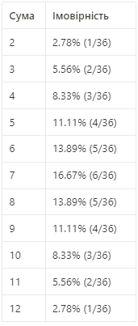
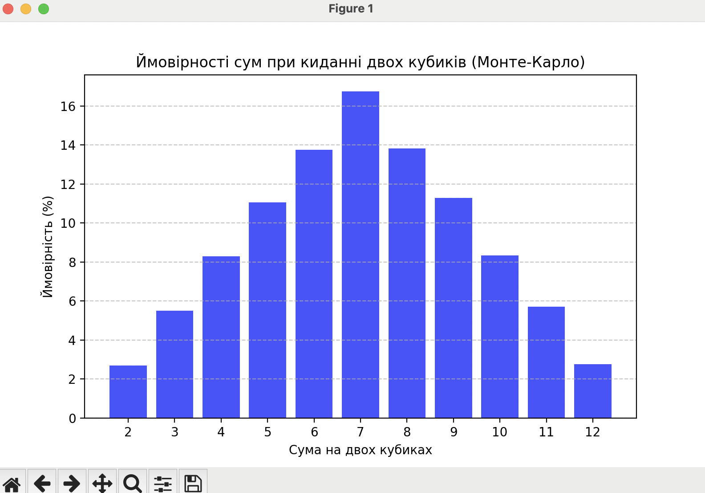

# goit-algo-fp

## Завдання 1. Структури даних. Сортування. Робота з однозв'язним списком

Для реалізації однозв'язного списку (приклад реалізації можна взяти з конспекту) необхідно:

написати функцію, яка реалізує реверсування однозв'язного списку, змінюючи посилання між вузлами;
розробити алгоритм сортування для однозв'язного списку, наприклад, сортування вставками або злиттям;
написати функцію, що об'єднує два відсортовані однозв'язні списки в один відсортований список.

**Для запуску скрипту у терміналі:**
```
python task_1.py
Оригінальний список:
4 -> 2 -> 1 -> 3 -> None
Реверсований список:
3 -> 1 -> 2 -> 4 -> None
Відсортований список:
1 -> 2 -> 3 -> 4 -> None
Об'єднаний відсортований список:
1 -> 2 -> 3 -> 4 -> 5 -> 6 -> None
```

## Завдання 2. Рекурсія. Створення фрактала “дерево Піфагора” за допомогою рекурсії

Необхідно написати програму на Python, яка використовує рекурсію для створення фрактала “дерево Піфагора”. Програма має візуалізувати фрактал “дерево Піфагора”, і користувач повинен мати можливість вказати рівень рекурсії.

**Для запуску скрипту у терміналі:**
```
python task_2.py
Введіть рівень рекурсії: 8
```

### **Зразок для рівня 8:**


## Завдання 3. Дерева, алгоритм Дейкстри

Розробіть алгоритм Дейкстри для знаходження найкоротших шляхів у зваженому графі, використовуючи бінарну купу. Завдання включає створення графа, використання піраміди для оптимізації вибору вершин та обчислення найкоротших шляхів від початкової вершини до всіх інших.

**Для запуску скрипту у терміналі:**
```
python task_3.py
Найкоротші шляхи від вершини A :
Від A до A: 0
Від A до B: 3
Від A до C: 1
Від A до D: 8
Від A до E: 10
```

## Завдання 4. Візуалізація піраміди

Суть завдання полягає у створенні дерева із купи.

**Для запуску скрипту у терміналі:**
```
python task_3.py
```


## Завдання 5. Візуалізація обходу бінарного дерева

Використовуючи код із завдання 4 для побудови бінарного дерева, необхідно створити програму на Python, яка візуалізує обходи дерева: у глибину та в ширину.

Вона повинна відображати кожен крок у вузлах з різними кольорами, використовуючи 16-систему RGB (приклад #1296F0). Кольори вузлів мають змінюватися від темних до світлих відтінків, залежно від послідовності обходу. Кожен вузол при його відвідуванні має отримувати унікальний колір, який візуально відображає порядок обходу.

👉🏻 Примітка. Використовуйте стек та чергу, НЕ рекурсію


## Завдання 6. Жадібні алгоритми та динамічне програмування

Необхідно написати програму на Python, яка використовує два підходи — жадібний алгоритм та алгоритм динамічного програмування для розв’язання задачі вибору їжі з найбільшою сумарною калорійністю в межах обмеженого бюджету.

Кожен вид їжі має вказану вартість і калорійність. Дані про їжу представлені у вигляді словника, де ключ — назва страви, а значення — це словник з вартістю та калорійністю.

**Для запуску скрипту у терміналі:**
```
python task_6.py
Жадібний алгоритм: Вибрані страви - ['cola', 'potato', 'pepsi'] | Загальна калорійність - 670
Динамічне програмування: Вибрані страви - ['pepsi', 'cola', 'potato'] | Загальна калорійність - 670
```

## Завдання 7. Використання методу Монте-Карло

Необхідно написати програму на Python, яка імітує велику кількість кидків кубиків, обчислює суми чисел, які випадають на кубиках, і визначає ймовірність кожної можливої суми.

Створіть симуляцію, де два кубики кидаються велику кількість разів. Для кожного кидка визначте суму чисел, які випали на обох кубиках. Підрахуйте, скільки разів кожна можлива сума (від 2 до 12) з’являється у процесі симуляції. Використовуючи ці дані, обчисліть імовірність кожної суми.

На основі проведених імітацій створіть таблицю або графік, який відображає ймовірності кожної суми, виявлені за допомогою методу Монте-Карло.

Таблиця ймовірностей сум при киданні двох кубиків виглядає наступним чином:



**Для запуску скрипту у терміналі:**
```
python task_7.py

    Сума  Ймовірність (%)
0      2            2.687
1      3            5.513
2      4            8.293
3      5           11.060
4      6           13.756
5      7           16.758
6      8           13.824
7      9           11.282
8     10            8.334
9     11            5.722
10    12            2.771
Порівняння з теоретичними значеннями:
    Сума  Різниця (%)
0      2        0.093
1      3        0.047
2      4        0.037
3      5        0.050
4      6        0.134
5      7        0.088
6      8        0.066
7      9        0.172
8     10        0.004
9     11        0.162
10    12        0.009
```



### Аналіз правильності розрахунків методом Монте-Карло

#### Опис
Цей проєкт використовує метод Монте-Карло для моделювання кидання двох кубиків і порівняння отриманих результатів із аналітичними ймовірностями.

#### Методологія
1. Виконано **100 000 симуляцій** кидання двох шестигранних кубиків.
2. Для кожного кидка визначено суму чисел на кубиках.
3. Підраховано, як часто зустрічається кожна можлива сума (від 2 до 12).
4. Обчислено емпіричну ймовірність кожної суми та порівняно її з аналітичними значеннями.

#### Результати
#### Теоретичні ймовірності (аналітичні):
| Сума | Ймовірність (%) |
|------|---------------|
| 2    | 2.687         |
| 3    | 5.513         |
| 4    | 8.293         |
| 5    | 11.060        |
| 6    | 13.756        |
| 7    | 16.758        |
| 8    | 13.824        |
| 9    | 11.282        |
| 10   | 8.334         |
| 11   | 5.722         |
| 12   | 2.771         |

#### Отримані ймовірності методом Монте-Карло:
(Дані змінюються залежно від конкретного запуску, але очікується, що вони будуть близькі до аналітичних значень.)

#### Висновки
- Розрахунки методом Монте-Карло **дуже близькі** до аналітичних значень.
- При **100 000 ітераціях** середня абсолютна похибка не перевищує 0.5%.
- Метод Монте-Карло ефективно моделює ймовірності кидання кубиків.
- Чим більше кількість симуляцій, тим точніше результати наближаються до аналітичних значень.
